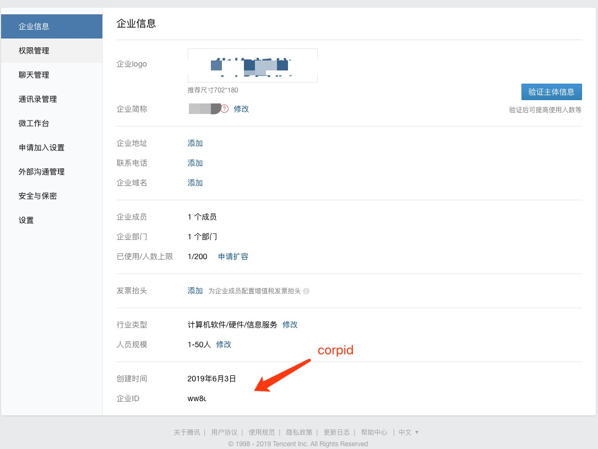
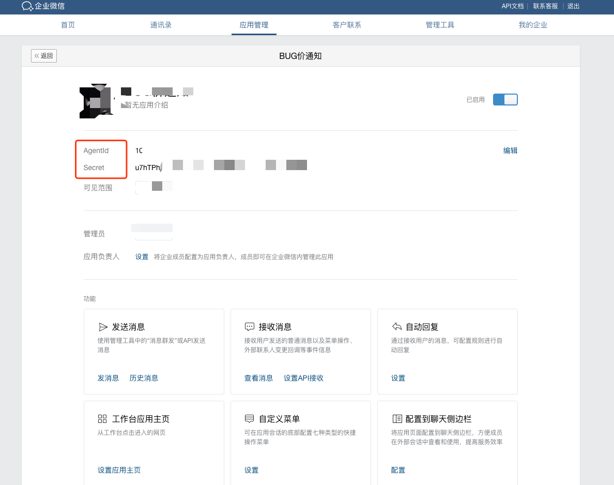
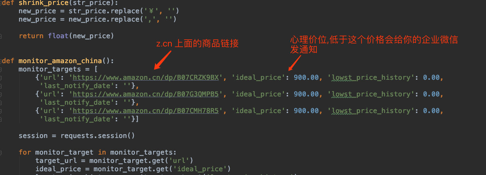
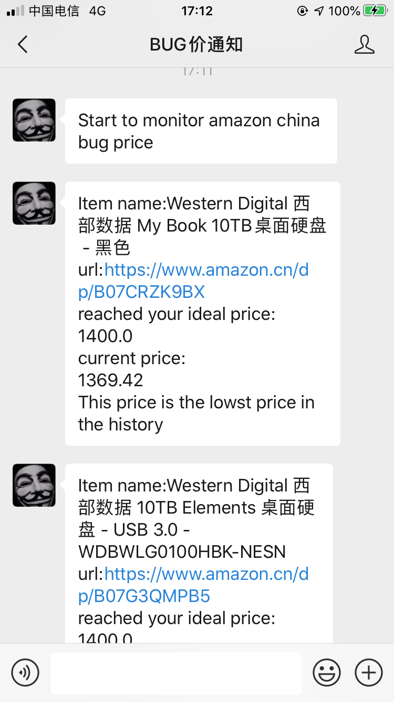

# price monitor
- 目前暂时只做到检测亚马逊中国上面指定商品的价格并发送微信通知到你的个人企业微信号
## 使用方法

1. 注册[企业微信](https://work.weixin.qq.com/)并创建应用
2. 修改 amazon_china_price_monitor.py 中的以下字段值为[你的企业微信网页](https://work.weixin.qq.com/)中显示的值:

- corpid

 
- corpsecret
- agentid

 
3. 修改 amazon_china_price_monitor.py 中的商品链接和心理价位:
 

 
4. 运行方法:
nohup python3 amazon_china_price_monitor.py &
 
5. 运气好，商品降价到你设置的心理价位的话:
你的企业微信对应应用中会收到如下类似信息,快去抢把😄

